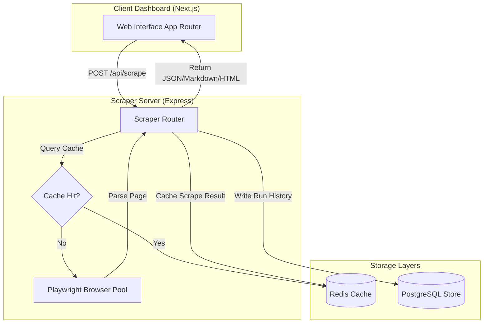

#  BlazeCrawl

BlazeCrawl is a high-performance, premium web scraping, data extraction, and content synchronization platform. Powered by an optimized browser pool and a dynamic dashboard visualizer, it simplifies web data extraction into clean, structured Markdown, Summary, Links, HTML, Screenshots, and Branding tokens.

---

## 🏗️ Architecture Workflow

The diagram below details the data flow between the Next.js Dashboard UI, the Express Scraper Server, the Redis caching layer, the persistent PostgreSQL database, and the Puppeteer/Playwright browser pool.



---

## 🚀 Quick Start

Follow these steps to run BlazeCrawl locally in your development environment.

### Prerequisites

- Node.js (>= v20.x)
- pnpm (>= v9.15.9)
- PostgreSQL & Redis

### 1. Clone the Repository

```bash
git clone https://github.com/lwshakib/blazecrawl.git
cd blazecrawl
```

### 2. Install Project Dependencies

BlazeCrawl is configured as a pnpm workspace. Install all workspace package dependencies:

```bash
pnpm install
```

### 3. Run Development Servers

Start PostgreSQL and Redis services, then launch the client dashboard and scraper API server concurrently:

```bash
pnpm dev
```

- **Web Dashboard**: http://localhost:3000
- **Scraper Server API**: http://localhost:5000

---

## 🛠️ Verification & Development Commands

Maintain code quality by running formatting checks and type verification:

- **Format Check**: Run Prettier code styling checks:
  ```bash
  pnpm format:check
  ```
- **ESLint Linter**: Verify syntax rules and catch errors:
  ```bash
  pnpm lint
  ```
- **Typescript Verification**: Compile-time check:
  ```bash
  pnpm typecheck
  ```
- **Build Compilation**: Create production builds for all workspace packages:
  ```bash
  pnpm build
  ```

---

## 📄 License and Contributing

For details on contributing, code guidelines, and community expectations:

- [CONTRIBUTING.md](./CONTRIBUTING.md)
- [CODE_OF_CONDUCT.md](./CODE_OF_CONDUCT.md)
